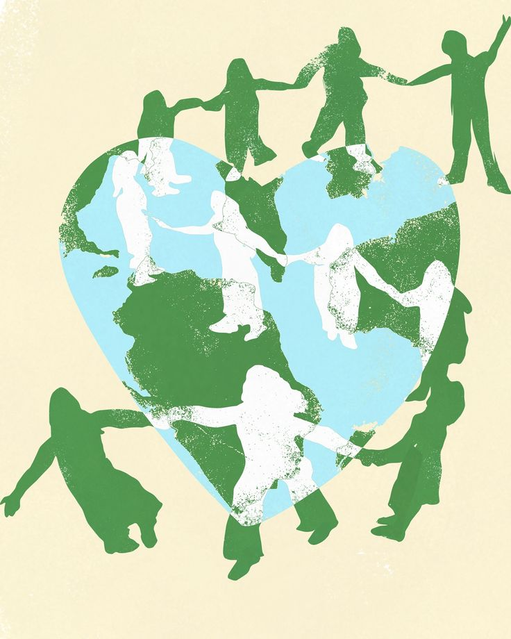

# projeto-one
Projeto front-end desenvolvido para uma ONG como atividade prática da disciplina de Desenvolvimento Front-End.
[index.html](https://github.com/user-attachments/files/33079644/index.html)
<!DOCTYPE html>
<html lang="pt-BR">
<head>
    <meta charset="UTF-8">
    <meta name="viewport" content="width=device-width, initial-scale=1.0">
    <title>ONG Esperança - Início</title>
    <link rel="stylesheet" href="style.css">
</head>
<body>
    <header>
        <h1>ONG Esperança</h1>
       <nav>
            <a href="index.html">Início</a>
            <a href="projetos.html">Projetos</a>
            <a href="cadastro.html">Cadastro</a>
       </nav>
    </header>
    <main>
        <section>
                <h2>Sobre a ONG</h2>
                
 
                    Nossa ONG atua na promoção da solicariedade e no desenvolvimento de ações sociais, buscando transformar a realidade de pessoas em situação de vulnerabilidade.
                

                
        </section>
        <section> 
            <h2>Entre em contato</h2>

            
Telefone: (43) 3333-3333

            
E-mail: contato@ongesperanca.org.br

            
Endereço: Londrina - PR

        </section>
    </main>
    <footer>
        
&copy; 2026 ONG Esperança. Todos os direitos reservados.

    </footer>
</body>
</html>  [projetos.html](https://github.com/user-attachments/files/33079655/projetos.html)

<!DOCTYPE html>
<html lang="pt-BR">
<head>
    <meta charset="UTF-8">
    <meta name="viewport" content="width=device-width, initial-scale=1.0">
    <title>ONG Esperança - Projetos</title>
    <link rel="stylesheet" href="style.css">
</head>
<body>
    <header>
        <h1>ONG Esperança</h1>
        <nav>
            <a href="index.html">Início</a>
            <a href="projetos.html">Projetos</a>
            <a href="cadastro.html">Cadastro</a>
        </nav>
    </header>
    <main>
        <section>
            <h2>Nossos projetos sociais</h2>
            <article>
                <h3>Projeto Alimentar</h3>
                

                    O pojeto Alimentar arrecada e distribui alimentos para famílias em situação de vulnerabilidade social.
                

            </article>
            <article>
                <h3>Projeto Educação</h3>
                

                    O Projeto Educação oferece apoio educacional, materiais escolares e atividades de incentivo á aprendizagem para crianças e adolescentes.
                

            </article>
            <article>
                <h3>Projeto solicariedade</h3>
                

                    O Projeto Solidariedade promove campanhas de arrecadação de roupas, produtos de higiene e outros itens essenciais.
                

            </article>
        </section>
        <section>
            <h2>Como fazer uma doação</h2>
            

                Você pode contribuir com alimentos, roupas, materiais escolares e outros itens necessários para o desenvolvimento das nossas ações sociais.
            

            

                Para saber quais itens estão sendo arrecadados no momento entre em contato conosco pelo telefone ou e-mail disponíveis na página inicial.
            

        </section>
        <section>
            <h2>Seja um Voluntário</h2>
            

                Pessoas interessadas em contribuir com seu tempo e suas habilidades podem participar das atividades e campnhas realizadas pela ONG.
            

            

                Para demonstrar interesse em ser voluntário, acesse a página de cadastro e preencha o formulário de participação.
            

            <a href="cadastro.hmtl">Quero ser Voluntário</a>
        </section>
    </main>
    <footer>
        
&copy; 2026 ONG Esperança. Todos os direitos reservados.

    </footer>
</body>
</html>

<!DOCTYPE html>
<html lang="pt-BR">
<head>
    <meta charset="UTF-8">
    <meta name="viewport" content="width=device-width, initial-scale=1.0">
    <title>ONG Esperança</title>
    <link rel="stylesheet" href="style.css">
</head>
<body>
    <header>
        <h1>ONG Esperança</h1>
        <nav>
            <a href="index.html">Início</a>
            <a href="projetos.html">Projetos</a>
            <a href="cadastro.html">Cadastro</a>
        </nav>
    </header>
    <main>
        <h2>Cadastro de participação</h2>

        

            Preencha o formulário abaixo para demonstrar seu interesse em participar das ações da ONG.
        

    
        <form action="#" method="post">
            <fieldset>
                <legend>Dados Pessoais</legend>
                

                    <label for="nome">Nome Completo:</label>
                    <input type="text" id="nome" minlength="3" maxlength="100" required>
                

                

                    <label for="nascimento">Data de nascimento:</label>
                    <input type="date" id="nascimento" name="nascimento" required>
                

                

                    <label for="cpf">CPF:</label>
                    <input type="text" id="cpf" name="cpf" placeholder="000.000.000-00" pattern="[0-9]{3}\.[0-9]{3}\.[0-9]{3}-[0-9]{2}" inputmode="numeric" required>
                

            </fieldset>
            <fieldset>
                <legend>Dados de contato</legend>
                

                    <label for="telefone">Telefone:</label>
                    <input type="tel" id="telefone" name="telefone" placeholder="(00) 00000-0000" pattern="\([0-9]{2}\) [0-9]{5}-[0-9]{4}" inputmode="tel" required>
                

                

                    <label for="email">E-mail:</label>
                    <input type="email" id="email" name="email" placeholder="exemplo"email.com" required>
                

            </fieldset>
            <fieldset>
                <legend>Endereço</legend>
                

                    <label for="cep">CEP:</label>
                    <input type="text" name="cep" id="cep" placeholder="00000-000" pattern="[0-9]{5}-[0-9]{3}" inputmode="numeric" required>
                

                

                    <label for="endereco">Endereço:</label>
                    <input type="text" id="endereco" name="endereco" maxlength="150" required>
                

                

                    <label for="cidade">Cidade:</label>
                    <input type="text" id="cidade" name="cidade" maxlength="80" required>
                

                

                    <label for="estado">Estado:</label>
                    <select id="estado" name="estado" required>
                        <option value="">Selecione</option>
                        <option value="PR">Paraná</option>
                        <option value="SP">São Paulo</option>
                        <option value="RJ">Rio de Janeiro</option>
                        <option value="SC">Santa Catarina</option>
                        <option value="RS">Rio Grande do Sul</option>
                    </select>
                

            </fieldset>
            <fieldset>
                <legend>participação</legend>
                
Como você deseja participar?

                

                    <input type="radio" id="voluntario" name="participacao" value="voluntario" required>
                    <label for="voluntario">Voluntário</label>
                

                

                    <input type="radio" id="doador" name="participacao" value="doador">
                    <label for="doador">Doador</label>
                

                

                    <input type="radio" id="ambos" name="participacao" value="ambos">
                    <label for="ambos">Voluntário e doador</label>
                

            </fieldset>
            <fieldset>
                

                    <label for="mensagem">
                        Conte brevemente como gostaria de contribuir:
                    </label>
                

                

                    <textarea name="mensagem" id="mensagem" rows="5" cols="50" maxlength="500" placeholder="Digite sua mensagem..."></textarea>
                

            </fieldset>
            

                <button type="submit">Enviar Cadastro</button>
                <button type="reset">Limpar formulário</button>
            

        </form>
    </main>
    <footer>
        
&copy; 2026 ONG Esperança. Todos os direitos reservados.

    </footer>
</body>
</html>

[cadastro.html](https://github.com/user-attachments/files/33079665/cadastro.html)

<!DOCTYPE html>
<html lang="pt-BR">
<head>
    <meta charset="UTF-8">
    <meta name="viewport" content="width=device-width, initial-scale=1.0">
    <title>ONG Esperança - Projetos</title>
    <link rel="stylesheet" href="style.css">
</head>
<body>
    <header>
        <h1>ONG Esperança</h1>
        <nav>
            <a href="index.html">Início</a>
            <a href="projetos.html">Projetos</a>
            <a href="cadastro.html">Cadastro</a>
        </nav>
    </header>
    <main>
        <section>
            <h2>Nossos projetos sociais</h2>
            <article>
                <h3>Projeto Alimentar</h3>
                

                    O pojeto Alimentar arrecada e distribui alimentos para famílias em situação de vulnerabilidade social.
                

            </article>
            <article>
                <h3>Projeto Educação</h3>
                

                    O Projeto Educação oferece apoio educacional, materiais escolares e atividades de incentivo á aprendizagem para crianças e adolescentes.
                

            </article>
            <article>
                <h3>Projeto solicariedade</h3>
                

                    O Projeto Solidariedade promove campanhas de arrecadação de roupas, produtos de higiene e outros itens essenciais.
                

            </article>
        </section>
        <section>
            <h2>Como fazer uma doação</h2>
            

                Você pode contribuir com alimentos, roupas, materiais escolares e outros itens necessários para o desenvolvimento das nossas ações sociais.
            

            

                Para saber quais itens estão sendo arrecadados no momento entre em contato conosco pelo telefone ou e-mail disponíveis na página inicial.
            

        </section>
        <section>
            <h2>Seja um Voluntário</h2>
            

                Pessoas interessadas em contribuir com seu tempo e suas habilidades podem participar das atividades e campnhas realizadas pela ONG.
            

            

                Para demonstrar interesse em ser voluntário, acesse a página de cadastro e preencha o formulário de participação.
            

            <a href="cadastro.hmtl">Quero ser Voluntário</a>
        </section>
    </main>
    <footer>
        
&copy; 2026 ONG Esperança. Todos os direitos reservados.

    </footer>
</body>
</html>

